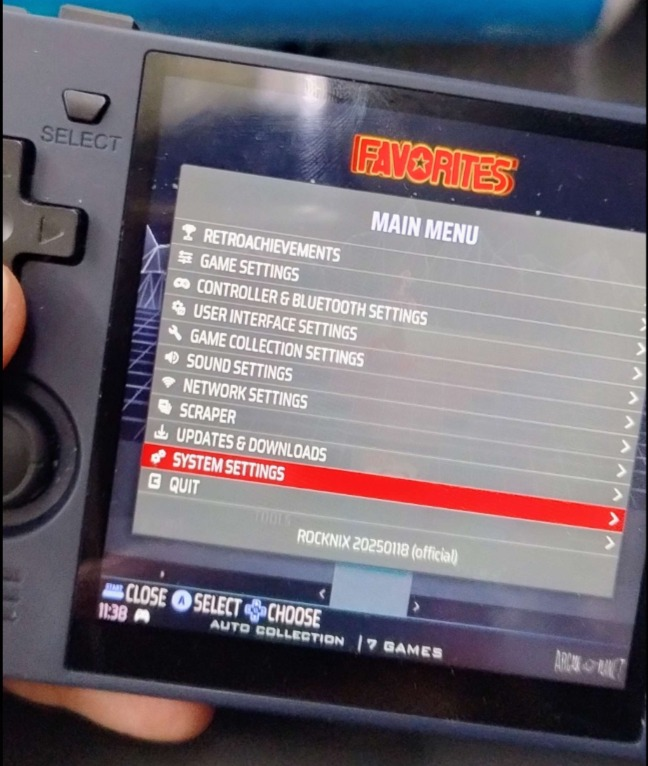
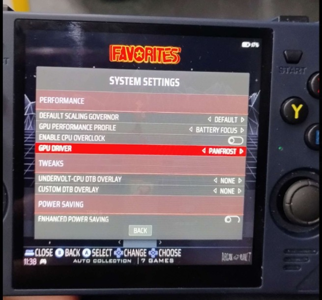

# PokeMMO Port for PortMaster

PokeMMO is a fan-made multiplayer online game that brings together multiple generations of Pokémon in a single MMO experience.

---

## 🛠 Installation Instructions

### CFW Tests:

|                        | 480x320 | 640x480 | 720x720 | Higher resolutions |
|------------------------|---------|---------|---------|--------------------|
| Playable?              | No      | Yes     | Yes     | Yes                |
| Create new character?  | No      | Yes (small)      | Yes     | Yes                |
| All regions?           | No      | Yes     | Yes     | Yes                |
| Global trade link                     | No      | Yes (small)    | Yes (small)    | Yes                |
| PC                     | No      | Yes (small)    | Yes (small)    | Yes                |

~~~
- [x] ArkOS
- [x] Rocknix
    -> [x] Panfrost
    -> [x] Libmali
- [x] MuOS
- [x] Knulli
- [x] spruceOS
~~~

### What is `hack.jar`?

`hack.jar` is a Java package that allows loading optimized shaders into memory for the following custom firmware (CFW).  
If a `credentials.txt` file exists, it will use the username and password specified there, but only during application startup.

The source code can be found here:  
👉 [PokeMMO/src](PokeMMO/src)

| Operating System       | Requires `hack.jar`? | Known Issues Without `hack.jar`                                                   |
|------------------------|----------------------|------------------------------------------------------------------------------------|
| **ArkOS**              | ✅ Yes               | - Screen freezes when flying - Starter Pokémon selection in NDS - Freeze in Johto |
| **Rocknix (Panfrost)** | ❌ No                | - Works fine without `hack.jar`                                                   |
| **Rocknix (Libmali)**  | ✅ Yes               | - Same issues as ArkOS                                                             |
| **MuOS**               | ✅ Yes               | - Screen freezes when flying - Starter Pokémon selection in NDS - Freeze in Johto |
| **Knulli**             | ✅ Yes               | - Screen freezes when flying - Starter Pokémon selection in NDS - Freeze in Johto |
| **spruceOS**           | ✅ Yes               | - Screen freezes when flying - Starter Pokémon selection in NDS - Freeze in Johto |

### FPS drops?

The configuration that comes with the program is the one recommended and tested on devices with very few resources, but if you have more resources you can change it.

If you changed the fps or the render settings that I left with a low-resource device, it will probably happen to you a lot.

main.properties is optimized for use with very low-resource devices in power saving mode.

It may take a while to load sometimes, depending on how demanding it is, but it shouldn't be a constant.

### Assigning Panfrost in Rocknix

To configure Rocknix to use the **Panfrost** driver, first ensure your device supports it and that it’s not the only available option. For example, the **Powkiddy RGB30** supports both **libMali (GLES 3.2)** and **Panfrost (GL 3.1/GLES 3.1)**, as shown [here](https://rocknix.org/devices/powkiddy/rgb30/#software).

To switch to the Panfrost driver:

### 1. Install/Update the Port

Download pokemmo.zip Place the `.zip` into:  
`/PortMaster/autoinstall`

Launch **PortMaster**. It will automatically install the port.

#### Here are the locations for the autoinstall folder for the

- AmberELEC, ROCKNIX, uOS, Jelos /roms/ports/PortMaster/autoinstall/
- muOS /mmc/MUOS/PortMaster/autoinstall/
- ArkOS /roms/tools/PortMaster/autoinstall/
- Knulli /userdata/system/.local/share/PortMaster/autoinstall

If that does not work you can also unzip the contents of the port into the ports folders of each cfw, note that this may break the port and ports may no longer start.

- AmberELEC, ROCKNIX, uOS, Jelos /roms/ports/
- muOS /mmc/ports/ for the folders and /mnt/mmc/ROMS/Ports/ for the .sh files
- ArkOS /roms/tools/PortMaster/autoinstall/
- Knulli /userdata/system/.local/share/PortMaster/autoinstall

---

### 2. Add Official PokeMMO Client Files

Go to the official PokeMMO website:  
[https://pokemmo.com/en/downloads/portable](https://pokemmo.com/en/downloads/portable)

Download the **portable version**, extract it, and copy these into:  
`/roms/ports/PokeMMO/`

- `PokeMMO.exe`  
- `data/` folder

⚠️  Make sure not to replace the existing shaders folder and main.properties, as it contains optimized shaders.
Replacing them may negatively impact performance on low-end devices.

---

### 3. Add Required and Optional ROMs

To add the ROMs, place them inside the PokeMMO/roms folder and set the following values in `main.properties`:
~~~
client.roms.nds=roms/pokemon_black.nds  
client.roms.em=roms/pokemon_emerald.gba  
client.roms.fr=roms/pokemon_firered.gba  
client.roms.nds2=roms/pokemon_platinum.nds  
client.roms.nds3=roms/pokemon_heartgold.nds
~~~

**Required ROM:**  
- Pokémon Black or White (Version 1)

**Optional ROMs (enable more regions):**  
- Fire Red  
- Emerald  
- Platinum  
- HeartGold / SoulSilver

---

### 🎮 Login Without Keyboard Input

If your device does not have a keyboard, you can try one of the following methods to log in:

#### 🔧 Option 1: PokeMMO/credentials.txt

Edit the file PokeMMO/credentials.txt with your login credentials.

#### 🔧 Option 2: Connect a Keyboard for First Login

Temporarily connect a physical keyboard (USB or Bluetooth), log in as usual, and make sure to check the **"Remember Me"** option.

#### 📝 Option 3: Type Password in Username Field (thanks ddrsoul)

Type your password in the **username** field, then **copy and paste** it into the password field. This allows you to use system copy/paste functions even without a keyboard.

The game will now automatically log in when launched on PortMaster-compatible devices.

---

### Controls

| Button | Action |
|--|--| 
|start| menu focus |
|R1| mouse left |
|L1| mouse right |
|A| A|
|B| B|
|X| Bag |
|Y| Hotkey 1  |
|L2| Hotkey 2 |
|R2| Hotkey 3 |
|L3| Hotkey 4 |
|R3| Hotkey 5 |
|select + B  | Hotkey 6 |
|select + A  | Hotkey 7 |
|select + X  | Hotkey 8 |
|select + R1  | Hotkey 9 |
|select + R2  | screenshot |
|select + L2  | mode dpad mouse (on) |
|select + Y  | mode text (on) |

#### Virtual Keyboard

| Button | Action |
|--|--| 
|start| mode text (off) |
|A| add character |
|B| backspace |
|X| space |
|Y| toggle case  |
|up | prev character |
|down | next character |
|select| toggle number/letter  |

---

### Known Bug

#### Calibrate cursor

---

## Thanks

- [Jeod](https://github.com/JeodC/)
- [BinaryCounter](https://github.com/binarycounter)
- ddrsoul
- lil gabo
- Fran
- [rttn](https://github.com/rttncraft)
- zerchu
- [Ganimoth](https://github.com/Ganimoth)
- antiNT
- cuongnv1312
- Brobba

## Refs

- Official site: [https://pokemmo.com](https://pokemmo.com)  
- Port suggestion on PortMaster: [View Suggestion](https://suggestions.portmaster.games/suggestion-details?id=ab4f9b6b87314eba96536a86804d7235)
---
